 

 

 

## 👋 About Me

<table width="100%">

<tr>
<td align="left">
🔴 🟡 🟢 &nbsp;<code>~/divyansh</code>&nbsp;&nbsp;<code>$ whoami</code>
</td>
</tr>

<tr>
<td align="left" valign="top">
<code>$ cat about.txt</code>
  
Computer Science & Engineering student building <b>Java backend systems</b> with Spring Boot, REST APIs and MySQL, and sharpening problem solving through <b>DSA</b>.
  
<code>$ cat learning.txt</code>
  
Currently learning <b>LLD</b>, <b>System Design</b>, <b>Docker</b> & <b>Kubernetes</b>.
</td>
</tr>

<tr>
<td align="left">
<code>$ echo "Always learning."</code> &nbsp;<code>▌</code>
</td>
</tr>

</table>

 

 

## 🔥 Where the Grind Happens

<table width="100%">

<tr>
<td colspan="3" align="left">
🔴 🟡 🟢 &nbsp;<code>~/divyansh/coding-profiles</code>&nbsp;&nbsp;<code>$ ls --platforms</code>
</td>
</tr>

<tr>

<td align="center" valign="middle" width="33%">
  

</td>

<td align="center" valign="middle" width="33%">
  

</td>

<td align="center" valign="middle" width="33%">
  

</td>

</tr>

<tr>
<td colspan="3" align="left">
<code>$ echo "Solve. Learn. Repeat."</code> &nbsp;<code>▌</code>
</td>
</tr>

</table>

 

 

## 📡 Live Stats

 

 

 

## 🛠️ Tech Stack

<table width="100%">

<tr>
<td align="left">
🔴 🟡 🟢 &nbsp;<code>~/divyansh/stack</code>&nbsp;&nbsp;<code>$ ls --all</code>
</td>
</tr>

<tr>
<td align="center">

</td>
</tr>

<tr>
<td align="left">
<code>$ echo "Right tool, right job."</code> &nbsp;<code>▌</code>
</td>
</tr>

</table>

 

 

## 🚀 Featured Projects

<table width="100%">

<tr>
<td align="left">
🔴 🟡 🟢 &nbsp;<code>~/divyansh/projects</code>&nbsp;&nbsp;<code>$ ls --featured</code>
</td>
</tr>

<tr>
<td align="center">
 

 

  

 

  

  

 

  

 

  
</td>
</tr>

<tr>
<td align="left">
<code>$ echo "Build. Break. Ship."</code> &nbsp;<code>▌</code>
</td>
</tr>

</table>

 

 

 

## 🐍 Contribution Snake

<table width="100%">

<tr>
<td align="left">
🔴 🟡 🟢 &nbsp;<code>~/divyansh/contributions</code>&nbsp;&nbsp;<code>$ ./snake --eat</code>
</td>
</tr>

<tr>
<td align="center">

  
<code>$ git log --graph --contributions</code>
  

</td>
</tr>

<tr>
<td align="left">
<code>$ echo "Every green square is a commit."</code> &nbsp;<code>▌</code>
</td>
</tr>

</table>

 

 

## 📊 GitHub Stats

<table width="100%">

<tr>
<td colspan="2" align="left">
🔴 🟡 🟢 &nbsp;<code>~/divyansh/github</code>&nbsp;&nbsp;<code>$ git log --stats</code>
</td>
</tr>

<tr>
<td colspan="2" align="center">
<picture><source media="(prefers-color-scheme: dark)" srcset="https://streak-stats.demolab.com/?user=divyansh1502&theme=dark&background=0D1117&border=30363D&stroke=30363D&border_radius=10&ring=4169E1&fire=FFC83D&currStreakLabel=FFC83D&currStreakNum=FFFFFF&sideLabels=FFFFFF&sideNums=FFFFFF&dates=C9D1D9"><source media="(prefers-color-scheme: light)" srcset="https://streak-stats.demolab.com/?user=divyansh1502&theme=default&background=FFFFFF&border=D0D7DE&stroke=D0D7DE&border_radius=10&ring=4169E1&fire=E5A800&currStreakLabel=1B3590&currStreakNum=0D1117&sideLabels=1B3590&sideNums=0D1117&dates=57606A"></picture>
</td>
</tr>

<tr>
<td align="center" width="50%">
<code>$ cat stats.json</code>  
<picture><source media="(prefers-color-scheme: dark)" srcset="https://github-readme-stats.vercel.app/api?username=divyansh1502&show_icons=true&bg_color=0D1117&border_color=30363D&border_radius=10&title_color=FFC83D&icon_color=4169E1&text_color=FFFFFF&ring_color=4169E1"><source media="(prefers-color-scheme: light)" srcset="https://github-readme-stats.vercel.app/api?username=divyansh1502&show_icons=true&bg_color=FFFFFF&border_color=D0D7DE&border_radius=10&title_color=1B3590&icon_color=4169E1&text_color=24292F&ring_color=4169E1"></picture>
</td>
<td align="center" width="50%">
<code>$ cat languages.json</code>  
<picture><source media="(prefers-color-scheme: dark)" srcset="https://github-readme-stats.vercel.app/api/top-langs/?username=divyansh1502&layout=compact&bg_color=0D1117&border_color=30363D&border_radius=10&title_color=FFC83D&text_color=FFFFFF"><source media="(prefers-color-scheme: light)" srcset="https://github-readme-stats.vercel.app/api/top-langs/?username=divyansh1502&layout=compact&bg_color=FFFFFF&border_color=D0D7DE&border_radius=10&title_color=1B3590&text_color=24292F"></picture>
</td>
</tr>

<tr>
<td colspan="2" align="left">
<code>$ echo "Commit daily."</code> &nbsp;<code>▌</code>
</td>
</tr>

</table>

 

 

 

## 🏆 Trophies & Profile Views

<table width="100%">

<tr>
<td align="left">
🔴 🟡 🟢 &nbsp;<code>~/divyansh/achievements</code>&nbsp;&nbsp;<code>$ ls --trophies</code>
</td>
</tr>

<tr>
<td align="center">
<picture><source media="(prefers-color-scheme: dark)" srcset="https://github-profile-trophy.vercel.app/?username=divyansh1502&theme=darkhub&no-frame=true&no-bg=true&margin-w=12&column=4&row=2"><source media="(prefers-color-scheme: light)" srcset="https://github-profile-trophy.vercel.app/?username=divyansh1502&theme=flat&no-frame=true&no-bg=true&margin-w=12&column=4&row=2"></picture>
  

</td>
</tr>

<tr>
<td align="left">
<code>$ echo "Trophies are earned, not given."</code> &nbsp;<code>▌</code>
</td>
</tr>

</table>

 

 

