


 

 

 

 


 

 

 

<a href="https://leetcode.com/u/divyansh_5ingh/"></a>
 

 
<a href="https://www.geeksforgeeks.org/profile/divyansh1502"></a>

  

<code>$ echo "Solve. Learn. Repeat."</code> &nbsp;<code>▌</code>

 

 

 

 

 

 

<picture>
<source media="(min-width: 760px)" srcset="./assets/tech-stack-wide.svg">
</picture>

  

<code>$ echo "Right tool, right job."</code> &nbsp;<code>▌</code>

 

 

<table width="100%">

<tr>
<td colspan="2" align="left">
🔴 🟡 🟢 &nbsp;<code>~/divyansh/projects</code>&nbsp;&nbsp;<code>$ ls --featured</code>
</td>
</tr>

<tr>
<td align="center" valign="top" width="50%">
 

</td>
<td align="center" valign="top" width="50%">
 

</td>
</tr>

<tr>
<td align="center" valign="top" colspan="2">
 

</td>
</tr>

<tr>
<td align="center" valign="top" width="50%">
 

</td>
<td align="center" valign="top" width="50%">
</td>
</tr>

<tr>
<td colspan="2" align="left">
<code>$ echo "Build. Break. Ship."</code> &nbsp;<code>▌</code>
</td>
</tr>

</table>

 

 

 

<table width="100%">

<tr>
<td align="left">
🔴 🟡 🟢 &nbsp;<code>~/divyansh/contributions</code>&nbsp;&nbsp;<code>$ ./snake --eat</code>
</td>
</tr>

<tr>
<td align="center">

  
<code>$ git log --graph --contributions</code>
  

</td>
</tr>

<tr>
<td align="left">
<code>$ echo "Every green square is a commit."</code> &nbsp;<code>▌</code>
</td>
</tr>

</table>

 

 

 

<picture>
<source media="(min-width: 760px)" srcset="./assets/github-stats.svg">
</picture>

  

<code>$ echo "Commit daily."</code> &nbsp;<code>▌</code>

 

 

 

<table width="100%">

<tr>
<td align="left">
🔴 🟡 🟢 &nbsp;<code>~/divyansh/achievements</code>&nbsp;&nbsp;<code>$ ls --trophies</code>
</td>
</tr>

<tr>
<td align="center">
  

</td>
</tr>

<tr>
<td align="left">
<code>$ echo "Trophies are earned, not given."</code> &nbsp;<code>▌</code>
</td>
</tr>

</table>

 

 

