  

 

 

## 👋 About Me

<table width="100%">

<tr>
<td align="left">
🔴 🟡 🟢 &nbsp;<code>~/divyansh</code>&nbsp;&nbsp;<code>$ whoami</code>
</td>
</tr>

<tr>
<td align="left" valign="top">
<code>$ cat about.txt</code>
  
Computer Science & Engineering student building <b>Java backend systems</b> with Spring Boot, REST APIs and MySQL, and sharpening problem solving through <b>DSA</b>.
  
<code>$ cat learning.txt</code>
  
Currently learning <b>LLD</b>, <b>System Design</b>, <b>Docker</b> & <b>Kubernetes</b>.
</td>
</tr>

<tr>
<td align="left">
<code>$ echo "Always learning."</code> &nbsp;<code>▌</code>
</td>
</tr>

</table>

 

 

## 🔥 Where the Grind Happens

<table width="100%">

<tr>
<td colspan="3" align="left">
🔴 🟡 🟢 &nbsp;<code>~/divyansh/coding-profiles</code>&nbsp;&nbsp;<code>$ ls --platforms</code>
</td>
</tr>

<tr>

<td align="center" valign="middle" width="33%">
  

</td>

<td align="center" valign="middle" width="33%">
  

</td>

<td align="center" valign="middle" width="33%">
  

</td>

</tr>

<tr>
<td colspan="3" align="left">
<code>$ echo "Solve. Learn. Repeat."</code> &nbsp;<code>▌</code>
</td>
</tr>

</table>

 

 

## 📡 Live Stats

 

 

 

## 🛠️ Tech Stack

<table width="100%">

<tr>
<td colspan="3" align="left">
🔴 🟡 🟢 &nbsp;<code>~/divyansh/stack</code>&nbsp;&nbsp;<code>$ ls --all</code>
</td>
</tr>

<tr>

<td align="center" valign="top" width="33%">
<code>$ ls backend/</code>
  

</td>

<td align="center" valign="top" width="33%">
<code>$ ls frontend/</code>
  

</td>

<td align="center" valign="top" width="33%">
<code>$ ls devops-tools/</code>
  

 

</td>

</tr>

<tr>
<td colspan="3" align="left">
<code>$ echo "Right tool, right job."</code> &nbsp;<code>▌</code>
</td>
</tr>

</table>

 

 

## 🚀 Featured Projects

<table width="100%">

<tr>
<td colspan="3" align="left">
🔴 🟡 🟢 &nbsp;<code>~/divyansh/projects</code>&nbsp;&nbsp;<code>$ ls --featured</code>
</td>
</tr>

<tr>
<td colspan="3" align="left" valign="top">
<code>$ cat hr-synergy/README.md</code>
  
<b>HR Synergy — Human Resource Management System</b>
 
Java Spring Boot application with authentication, employee management (CRUD), REST APIs and MySQL. Built during my Spring Boot internship.
  
<code>Java</code> <code>Spring Boot</code> <code>Hibernate</code> <code>JDBC</code> <code>MySQL</code> <code>Thymeleaf</code> <code>Maven</code>
  
<code>$ git clone</code> &nbsp;
</td>
</tr>

<tr>

<td width="33%" align="left" valign="top">
<code>$ cat qrder/README.md</code>
  
<b>QRder</b>
 
QR-based restaurant ordering with digital menus, order management and a commission-based model.
  
<code>Java</code> <code>Spring Boot</code> <code>React</code> <code>MySQL</code>
</td>

<td width="33%" align="left" valign="top">
<code>$ cat spotify-clone/README.md</code>
  
<b>Spotify Clone</b>
 
Music streaming UI with an interactive player.
  
<code>HTML</code> <code>CSS</code> <code>JavaScript</code>
  

</td>

<td width="33%" align="left" valign="top">
<code>$ cat sidcup-golf/README.md</code>
  
<b>Sidcup Golf Clone</b>
 
Frontend recreation with smooth scrolling and GSAP animations.
  
<code>HTML</code> <code>CSS</code> <code>JavaScript</code> <code>GSAP</code>
  

</td>

</tr>

<tr>
<td colspan="3" align="left">
<code>$ echo "Build. Break. Ship."</code> &nbsp;<code>▌</code>
</td>
</tr>

</table>

 

 

## 🐍 Contribution Snake

<table width="100%">

<tr>
<td align="left">
🔴 🟡 🟢 &nbsp;<code>~/divyansh/contributions</code>&nbsp;&nbsp;<code>$ ./snake --eat</code>
</td>
</tr>

<tr>
<td align="center">

</td>
</tr>

<tr>
<td align="left">
<code>$ echo "Every green square is a commit."</code> &nbsp;<code>▌</code>
</td>
</tr>

</table>

 

 

## 📊 GitHub Stats

<table width="100%">

<tr>
<td colspan="2" align="left">
🔴 🟡 🟢 &nbsp;<code>~/divyansh/github</code>&nbsp;&nbsp;<code>$ git log --stats</code>
</td>
</tr>

<tr>
<td colspan="2" align="center">

</td>
</tr>

<tr>
<td align="center" width="50%">
<code>$ cat stats.json</code>  

</td>
<td align="center" width="50%">
<code>$ cat languages.json</code>  

</td>
</tr>

<tr>
<td colspan="2" align="left">
<code>$ echo "Commit daily."</code> &nbsp;<code>▌</code>
</td>
</tr>

</table>

 

